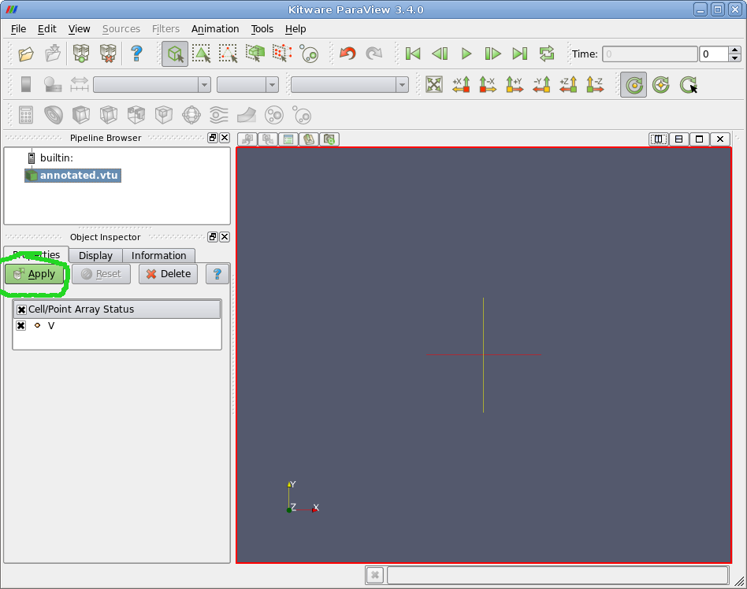
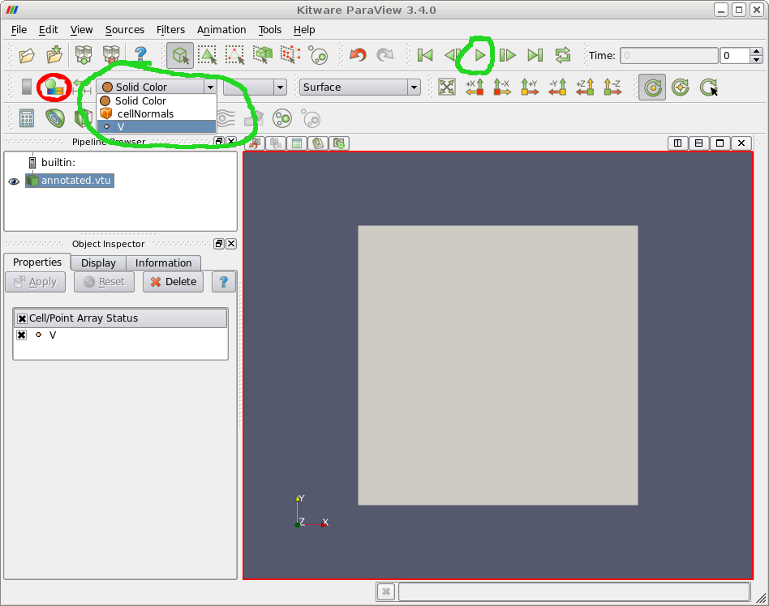
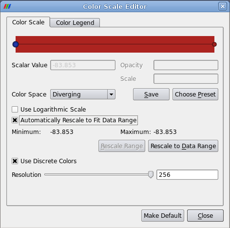

Paraview is a popular VTK-based visualisation tool.  Chaste can convert its simulation results into the VTK format, including support for parallel VTK when running simulations in parallel.
Paraview also supports an annotated VTK format which allows animating the results of time-varying simulations, and we provide a script to add these annotations to Chaste results.

For general information on using Paraview, see its [online documentation](http://www.paraview.org/paraview/help/documentation.html).

When VTK output has been requested (e.g. using the class:HeartConfig `SetVisualizeWithVtk` method or the `OutputVisualizer` element in Chaste's XML input file), then the simulation results folder will contain a `vtk_output` subfolder.  This will contain a `.vtu` file for normal VTK output, or a `.pvtu` file for parallel VTK output.

To add Paraview's animation annotations, run our script using a command like:

```

<path_to_Chaste>/python/utils/AddVtuTimeAnnotations.py <original_results>.vtu <annotated_results>.vtu

```


Launch Paraview with

```

#!sh
paraview --data=<annotated_results>.vtu

```


You should see an initial window looking something like that below.  Click on the green 'Apply' button to get things started.



Select the component of the results to visualise from the 'Solid Color' drop-down menu, circled in green in the screenshot below.  This will typically be 'V' for the transmembrane potential or 'Phi_e' for the extracellular potential in a bidomain simulation.

Finally, click the 'play' button (also circled in green) to animate the results.



If running on an older version of Paraview and using time annotations, you may need to set the colour scale manually.  The dialog shown below is accessed via the button circled in red above.



Uncheck 'Automatically Rescale to Fit Data Range' and then press 'Rescale Range' to enter suitable maximum and minimum values.
