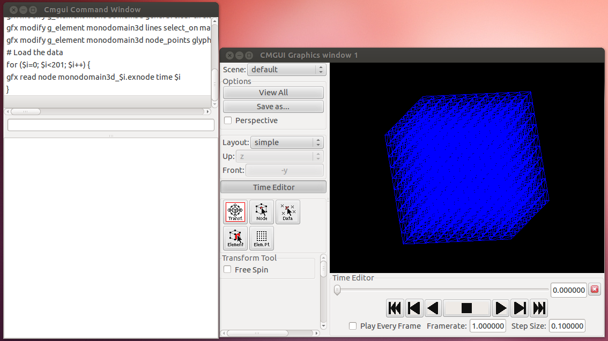
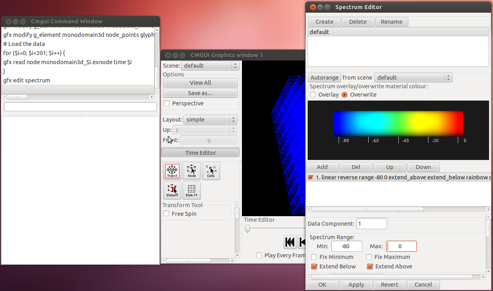
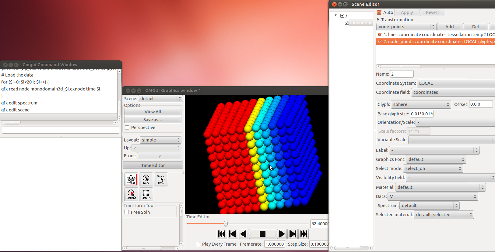
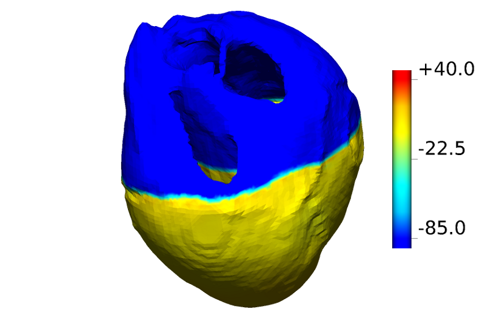

Cmgui is a powerful visualization tool that has several key features that make it unique:

* It is scriptable, i.e., you can feed it with a series of text instructions and Cmgui will simply print out the images you require.
* It allows for visualization of moving meshes, which makes it very useful for mechanics simulations.
* The images produced are always somewhat better looking than other visualizers.


On the other hand, using Cmgui is not as intuitive as, for example, [Meshalyzer](using-meshalyzer).

The best place to start is the [Cmgui examples page](http://cmiss.bioeng.auckland.ac.nz/development/examples/a/index.html). In particular, it is advisable to start with the first one: [viewing a cube](http://cmiss.bioeng.auckland.ac.nz/development/examples/a/a1/index.html).
At any point in time, it is often useful to consult the [full list of cmgui commands](http://cmiss.bioeng.auckland.ac.nz/development/help/cmgui/gfx/index.html).

## Basic usage of the graphical front end after a Chaste simulation

Chaste is capable of outputting Cmgui-readable files containing the solution of the simulation. Since mastering Cmgui may take some time, Chaste also outputs a little script called 
```
LoadSolutions.com
```
 that makes the user skips the first steps of reading the mesh from file and loading up the data.
The Chaste Cmgui output is located within a directory called *cmgui_output*. After running a Chaste simulation, the best thing to do is to go to that *cmgui_output* directory and type

```

PATH_TO_CMGUI_EXECUTABLE LoadSolutions.com

```


where PATH_TO_CMGUI_EXECUTABLE refers to the place where you put your cmgui executable. This will pop up the graphics and command windows as shown here



Within the graphic window


* Left-click and move --> Rotate object
* Right-click and move up --> Zoon-out
* Right-click and move down --> Zoom-in


Note that the instruction above loaded the geometry AND the data. It is instructive to give a look at the script and see the PERL-style syntax of Cmgui.

If you want to change the spectrum, select Graphic-->Spectrum editor. Here you can adjust the spectrum minimum and maximum as shown here



Another very useful window is *Scene Editor* which you can bring up by choosing Graphic-->Scene editor. ehre you can manipulate what you see and how. In the example below, I choose to visualize my nodes as little spheres



## More advanced usage using Cmgui scripts

As mentioned above, one of the most powerful features of Cmgui is that you can feed a script to it and Cmgui will just print the image you like. The syntax of the script is a Perl-like syntax.
All Cmgui commands have the structure of **gfx COMMAND_NAME options**. Comments are preceded by the **#** character.

Here, we will comment an example of a script that was used for a published figure.

We start by reading in the mesh. We will issue 2 **read** commands, one for nodes and one for elements, followed by the path to the node and element files respectively. We then define the faces so that we can plot a surface. In this example, **monodomain3d** is the name of the group used in the Chaste simulation.


```

# Read the mesh
gfx read node MyocytesPlusFibroblasts/cmgui_output/extended1d.exnode
gfx read elem MyocytesPlusFibroblasts/cmgui_output/extended1d.exelem
gfx define faces egroup monodomain3d

```


Now we load the data, which is conatained in a **.exnode** file. There will be one of these files per time step of simulation.

```

# Load the data
gfx read node MyocytesPlusFibroblasts/cmgui_output/extended1d_140.exnode

```

An alternative is to read **ALL** time steps in one go by means of a for loop (in this case we have 200 time steps):

```

for ($i=0; $i<201; $i++) {
gfx read node extended1d_$i.exnode time $i
}

```

Then we create a graphical window:

```

# Create a window
gfx create window 1 double_buffer;

```

and then adjust our preferred view. You can choose your view by playing with the mouse and when you are happy with it, you can issue a command (in the cmgui command window)

```

gfx list window 1 commands

```


The output can be copied and pasted in our script so that next time the very same angle, point of view, etc will be re-created exactly. An example of an output is

```

gfx modify window 1 image scene default light_model default;
gfx modify window 1 image add_light default;
gfx modify window 1 layout simple ortho_axes z -y eye_spacing 0.25 width 1715 height 1125;
gfx modify window 1 set current_pane 1;
gfx modify window 1 background colour 0 0 0 texture none;
gfx modify window 1 view parallel eye_point 8.58981 3.21216 5.66403 interest_point 1.18447 1.10423 1.46629 up_vector -0.502462 0.0458483 0.863383 view_angle 26.953 near_clipping_plane 0.0876946 far_clip$
gfx modify window 1 set transform_tool current_pane 1 std_view_angle 40 normal_lines no_antialias depth_of_field 0.0 fast_transparency blend_normal;

```


Similar consideration apply for the spectrum. You can play with the graphical interface until you are happy with it and then, in the CMgui command window, issue a command

```

gfx list spectrum default commands

```

copy and paste the output in the script. In our example, the output will look like

```

gfx modify spectrum default clear overwrite_colour;
gfx modify spectrum default linear reverse range -85 40 extend_above extend_below rainbow colour_range 0 1 component 1;

```

The following instructions are used to make the spectrum appear on your image

```

#put the spectrum in...
gfx cre scene overlay
gfx mod scene overlay add_light default
gfx mod win 1 overlay scene overlay
gfx create colour_bar spectrum default
gfx cre colour_bar as colour_bar axis 0 1 0 centre 1 0 0 divisions 2 font BIG length 1 number_format %+.1f label_material black tick_direction 1 0 0

gfx draw colour_bar scene overlay position 0

```

The following instructions are obtained with the command

```

gfx list g_element XXXX commands

```

and are the ones that specify the nature of your graphical elements (e.g, nodes as spheres, lines hidden or showing, surface hidden or showing, etc)

```

gfx modify g_element extended1d general clear circle_discretization 6 default_coordinate coordinates element_discretization "4*4*4" native_discretization none;
gfx modify g_element extended1d lines select_on invisible material default data Vm_1 spectrum default selected_material default_selected;
gfx modify g_element extended1d node_points glyph point general size "1*1*1" centre 0,0,0 font default select_on invisible material default data Vm_1 spectrum default selected_material default_selected;
gfx modify g_element extended1d surfaces select_on material default data Vm_1 spectrum default selected_material default_selected render_shaded;

```

Finally, we print the output

```

gfx print postscript file myo_plus_fibro.eps win 1

```

The full script we just discussed is


```

# Read the mesh
gfx read node MyocytesPlusFibroblasts/cmgui_output/extended1d.exnode
gfx read elem MyocytesPlusFibroblasts/cmgui_output/extended1d.exelem generate_faces_and_lines
# Load the data
gfx read node MyocytesPlusFibroblasts/cmgui_output/extended1d_140.exnode

# Create a window
gfx create window 1 double_buffer;
gfx modify window 1 image scene default light_model default;
gfx modify window 1 image add_light default;
gfx modify window 1 layout simple ortho_axes z -y eye_spacing 0.25 width 1715 height 1125;
gfx modify window 1 set current_pane 1;
gfx modify window 1 background colour 0 0 0 texture none;
gfx modify window 1 view parallel eye_point 8.58981 3.21216 5.66403 interest_point 1.18447 1.10423 1.46629 up_vector -0.502462 0.0458483 0.863383 view_angle 26.953 near_clipping_plane 0.0876946 far_clip$
gfx modify window 1 set transform_tool current_pane 1 std_view_angle 40 normal_lines no_antialias depth_of_field 0.0 fast_transparency blend_normal;

# SPECTRUM
gfx modify spectrum default clear overwrite_colour;
gfx modify spectrum default linear reverse range -85 40 extend_above extend_below rainbow colour_range 0 1 component 1;

gfx define font BIG "50 default normal normal"

#put the spectrum in...
gfx cre scene overlay
gfx mod scene overlay add_light default
gfx mod win 1 overlay scene overlay
gfx create colour_bar spectrum default
gfx cre colour_bar as colour_bar axis 0 1 0 centre 1 0 0 divisions 2 font BIG length 1 number_format %+.1f label_material black tick_direction 1 0 0


gfx draw colour_bar scene overlay position 0

# Modify the scene (obtained by gfx list g_element XXXX commands)
gfx modify g_element extended1d general clear circle_discretization 6 default_coordinate coordinates element_discretization "4*4*4" native_discretization none;
gfx modify g_element extended1d lines select_on invisible material default data Vm_1 spectrum default selected_material default_selected;
gfx modify g_element extended1d node_points glyph point general size "1*1*1" centre 0,0,0 font default select_on invisible material default data Vm_1 spectrum default selected_material default_selected;
gfx modify g_element extended1d surfaces select_on material default data Vm_1 spectrum default selected_material default_selected render_shaded;

#Print the output
gfx print postscript file myo_plus_fibro.eps win 1

quit

```


Results of the script above, i.e, the file **myo_plus_fibro.eps** looks like


