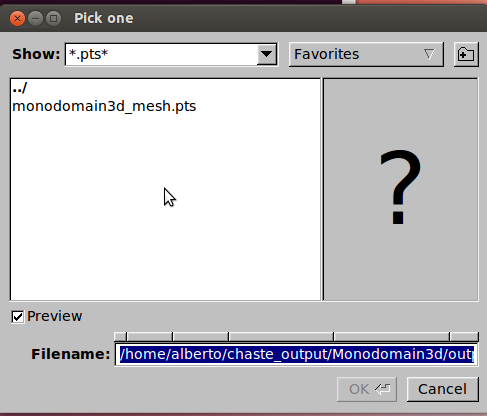
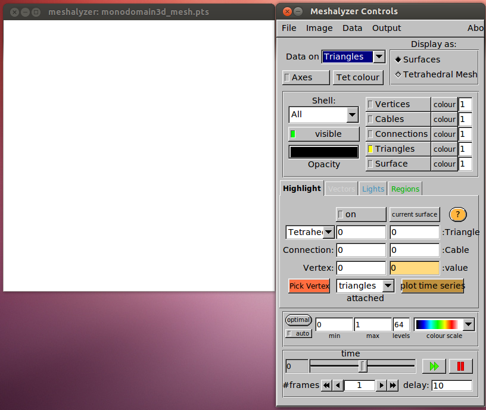
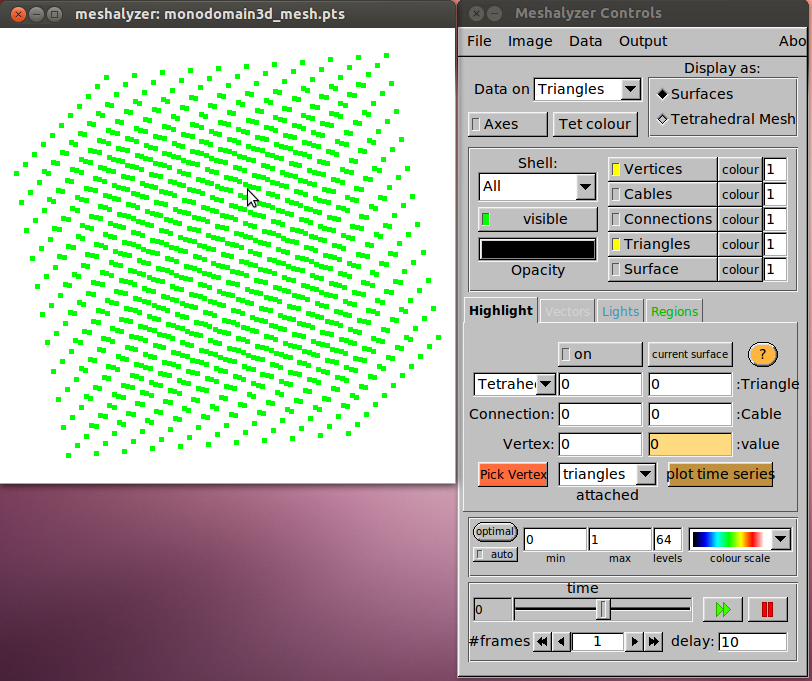
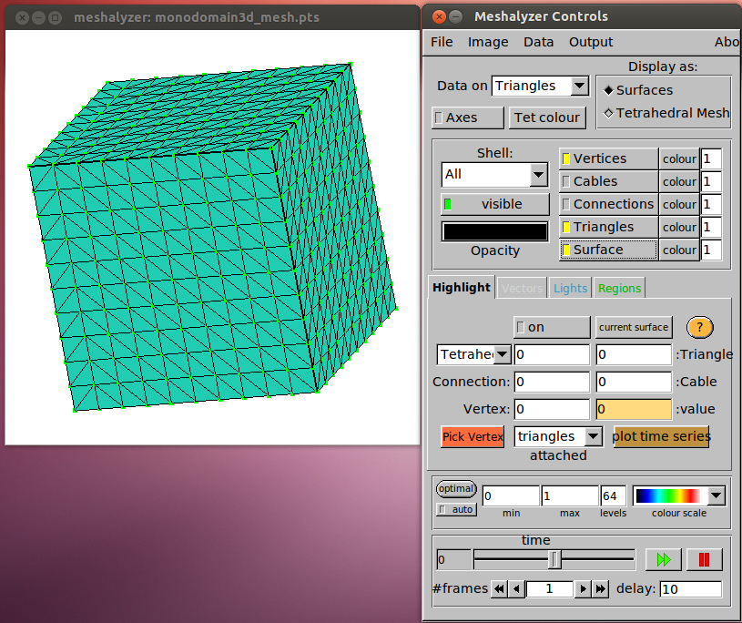
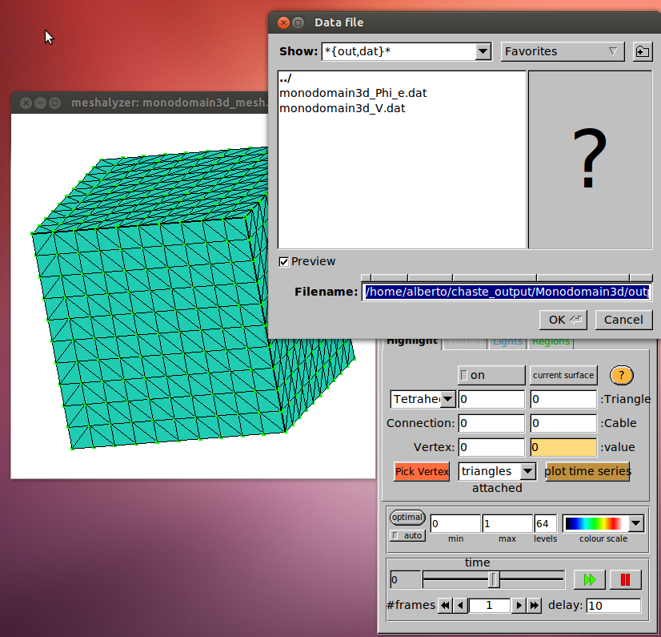
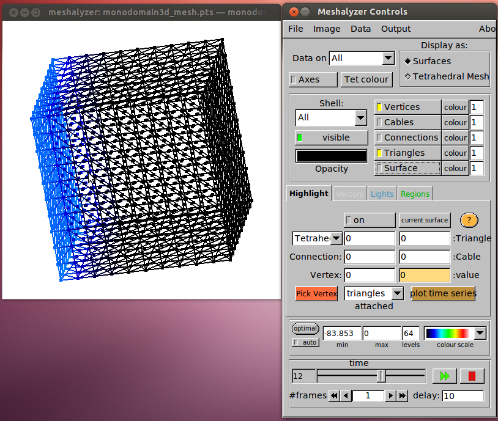

This page shows how to use the Meshalyzer visualization tool.

If your results were generated using Chaste, then you will find the meshalyzer output within a subdirectory of your results directory called *output*.

The files that describe the geometry are:

* FILENAME_mesh.pts (the nodes of the mesh you sued in your simulation)
* FILENAME_mesh.tri and FILENAME_mesh.tetras (the connections between the nodes)

The output data of your simulation are in files called

* FILENAME_VARIABLENAME.dat

where you will have as many files as many output variables (typically the unknowns) of your simulation.

First thing to do is to fire up the meshalyzer executable you downloaded. Simply open a terminal and type the path to the meshalyzer executable. You will be prompted with a window like this one

where you will be asked to choose a mesh file. Navigate your way to your simulation results directory (*output* sub-directory) until you find the *.pts* file that describes the geometry of your simulation. Select it and click OK. This will pop up two windows that look like this at first

the one on the right is the Control Panel. The one on the left is where the visualization will occur. At the moment that is blank. To view the geometry, simply click on the *Vertices* Button as shown here

in this example, the geometry is just a cube. The mouse buttons for meshalyzer visualization window are as follows:

* Left-click and move --> Rotate object
* Right-click and move up --> Zoon-out
* Right-click and move down --> Zoom-in

If you want to add connection between nodes, click on File--> Add Surface and find your FILENAME_mesh.tri file. After doing this, you can click on the "Surface" button in the Control Panel and see something like

So far, we only loaded up the geometry of the simulation. We now want to plot our results on the given geometry.

To do so, click on File-->Read Data and choose one of your FILENAME_VARIABLENAME.dat file

In this example, my Chaste simulation had given two variables as output (V and Phi_e). Once you choose one, the data will be plotted on your mesh. You can tune where you want your data shown with the drop-down menu **Data on** near the top. You can choose what you see by clicking the respective buttons. You can tune the spectrum below by adjusting minimum and maximum and you can play your simulation over time with the time player at the bottom. In the example below, you can see the variable V plotted with a spectrum from -83.853 (min) to 0 (max) at time 12 of the simulation. Variable is visualized on triangles and connections. Surface is hidden.

If you want to **export** an image, click on Output and select the desired format (png, eps, pdf available). If you want to record a movie, Meshalyzer will produce a sequence of images by clicking on Output-->Record-->Start and then starting the animation (big double green arrow at the bottom) and then Output-->Record-->Stop when you are done.

